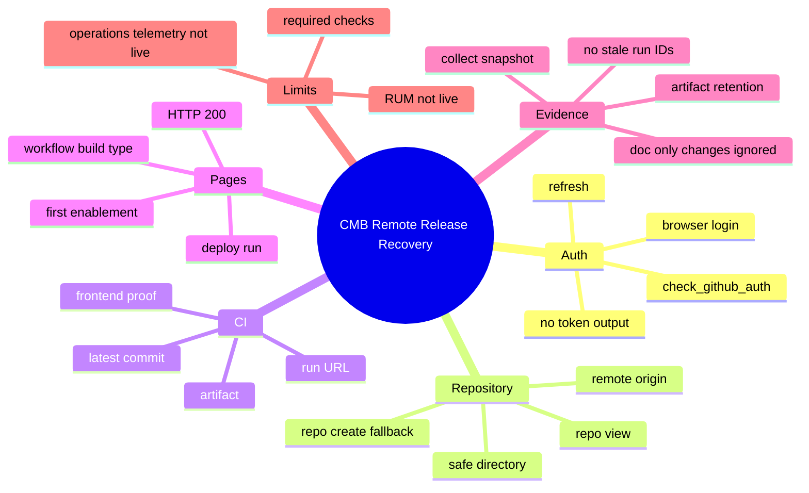

# Remote Release Recovery

Status: `active`

This file captures how CMB handles token expiry, GitHub remote proof, Pages bootstrap, and evidence churn.

## Mindmap

## Current World-Class Controls

- Auth preflight: `check_github_auth.ps1`
- Auth + deploy wrapper: `deploy_github_remote.ps1`
- Evidence collector: `collect_github_remote_evidence.ps1`
- CI artifact retention: `.github/workflows/cmb-frontend-proof.yml`
- Pages deployment: `.github/workflows/cmb-pages.yml`
- Required-check reliability: `cmb-frontend-proof.yml` runs on every push/PR so the required check is not left pending by path filters.

## Latest Evidence

- App/workflow proof SHA: `eafbe2ed943cc50d534953cc800ef335fc955d22`
- Frontend proof run: `https://github.com/joonhyoun988-droid/cmb-recommended-free-web/actions/runs/27927359323`
- Pages deploy run: `https://github.com/joonhyoun988-droid/cmb-recommended-free-web/actions/runs/27927359316`
- Pages URL: `https://joonhyoun988-droid.github.io/cmb-recommended-free-web/`
- Pages HTTP status: `200`
- Required check: branch protection requires always-on `frontend-proof`
- Artifact: `cmb-frontend-proof-eafbe2ed943cc50d534953cc800ef335fc955d22`
- Artifact API: `https://api.github.com/repos/joonhyoun988-droid/cmb-recommended-free-web/actions/artifacts/7782537320`

## Remaining Gaps

- Real-user Web Vitals/RUM is still not live.
- Production observability is still a plan, not a live signal.
