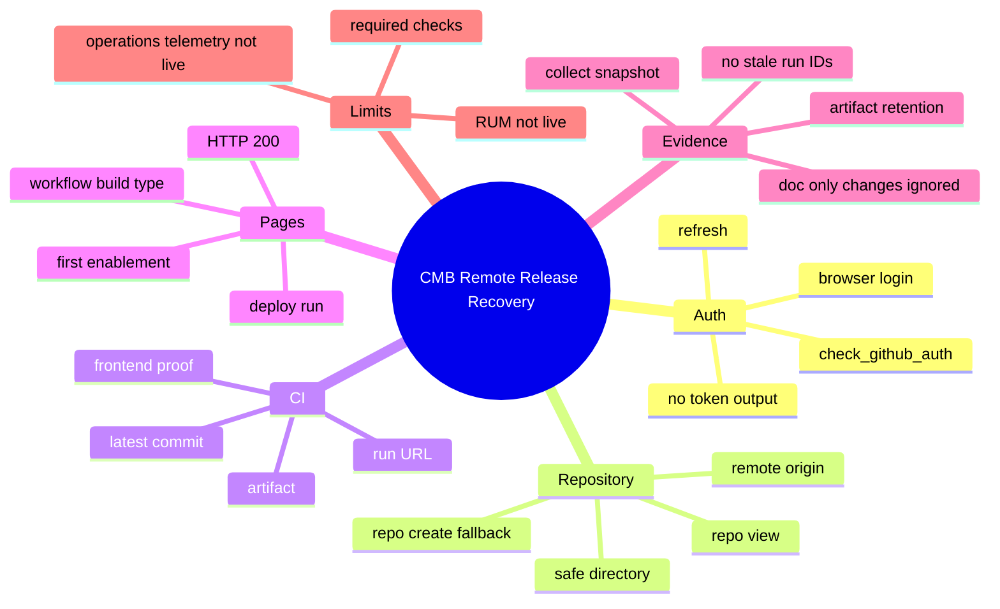

# Remote Release Recovery

Status: `active`

This file captures how CMB handles token expiry, GitHub remote proof, Pages bootstrap, and evidence churn.

## Mindmap

## Current World-Class Controls

- Auth preflight: `check_github_auth.ps1`
- Auth + deploy wrapper: `deploy_github_remote.ps1`
- Evidence collector: `collect_github_remote_evidence.ps1`
- CI artifact retention: `.github/workflows/cmb-frontend-proof.yml`
- Pages deployment: `.github/workflows/cmb-pages.yml`
- Doc-only churn prevention: workflows use `paths` filters so markdown evidence updates do not rerun app proof.

## Remaining Gaps

- Required status checks / branch ruleset is still not enforced.
- Real-user Web Vitals/RUM is still not live.
- Production observability is still a plan, not a live signal.
